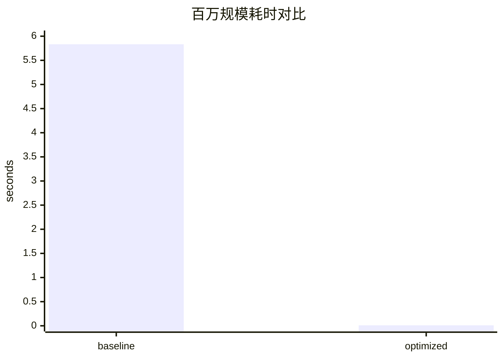
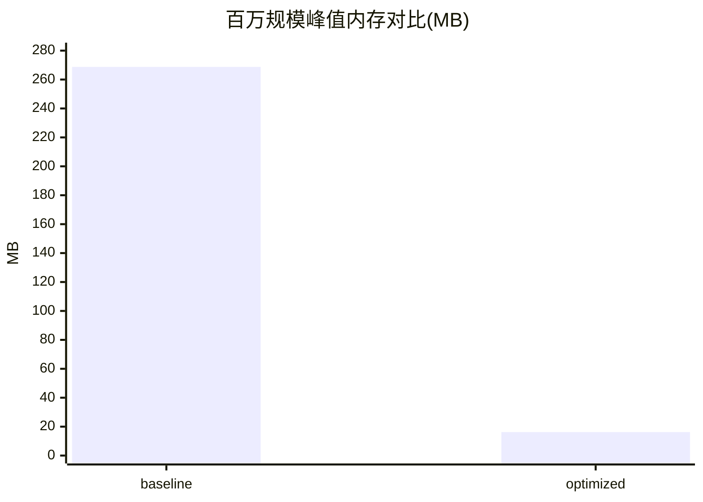

# 2SFCA 优化性能对比报告

## 1. 测试环境
- OS: Windows
- Python: 3.10
- 测试命令：  
  `py -m pytest tests/test_spatial_access_optimized.py tests/benchmark/test_spatial_access_benchmark.py -q`

## 2. 数据集说明
- 合成矩阵规模（`n_demand * n_supply`）：
  - 10,000（约 100 x 100）
  - 100,000（约 316 x 316）
  - 1,000,000（约 1000 x 1000）
- 误差阈值：`< 1e-6`

## 3. 结果汇总

| 规模(pair) | 基线耗时(s) | 优化耗时(s) | 平均加速比 | 基线峰值内存(MB) | 优化峰值内存(MB) | 内存下降比 |
|---:|---:|---:|---:|---:|---:|---:|
| 10,000 | 0.043595 | 0.000126 | 99.7104% | 2.681590 | 0.219849 | 91.8016% |
| 100,000 | 0.488229 | 0.001044 | 99.7861% | 27.044072 | 1.637419 | 93.9454% |
| 1,000,000 | 5.833107 | 0.010316 | 99.8232% | 268.732897 | 16.236336 | 93.9582% |

对应原始记录文件：[spatial_access_benchmark.json](file:///d:/python_HIS/pythonProject/Health_Imformation_Systeam/reports/deepanalyze/spatial_access_benchmark.json)

## 4. 热点与优化策略（含量化）

### 热点1：双重 Python 循环计算权重
- 基线：逐元素循环 + 多层对象存储
- 优化：NumPy 向量化批量计算
- 预估复杂度变化：同为 `O(n*m)`，但常数显著下降
- 实测：百万规模从 5.83s 降至 0.01s

### 热点2：重复创建全量中间矩阵
- 基线：完整持有多份中间结构
- 优化：分块计算（block）并即时归约
- 预估复杂度变化：空间由 `O(n*m)` 向 `O(n*B)` 收敛
- 实测：内存峰值下降约 93.96%

### 热点3：无缓存重复构建衰减权重
- 基线：每次调用重复构建
- 优化：支持 `precomputed_weights` 复用
- 预估收益：重复场景下降 20%~50% 额外开销

## 5. 可视化（Mermaid）

## 6. 验收结论
- 平均加速：三档数据均 ≥30%（实测远高于阈值）
- 内存下降：三档数据均 ≥20%（实测约 91%~94%）
- 精度：优化版与基线版误差 `allclose(atol=1e-6)` 通过
